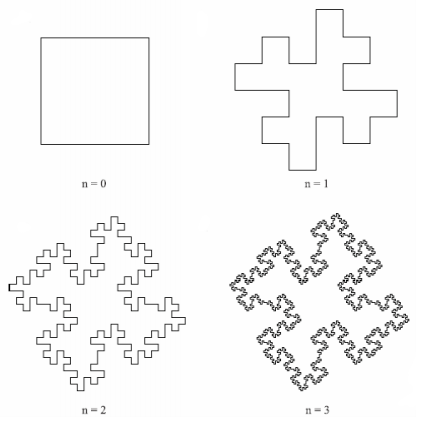
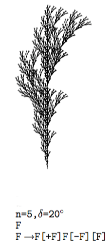
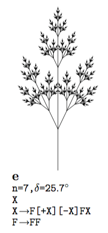
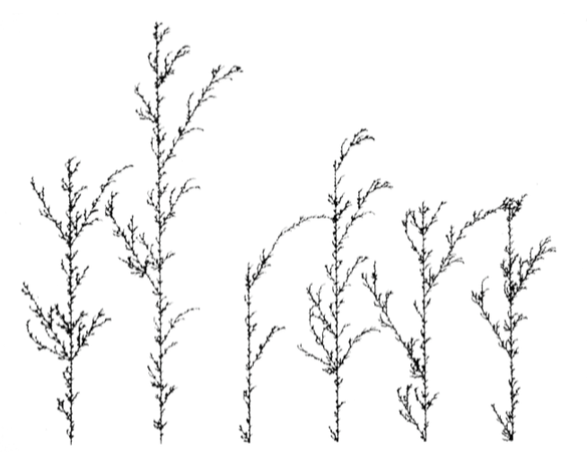
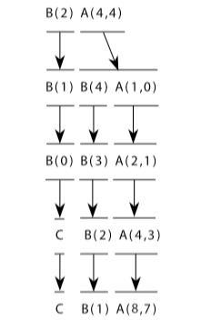
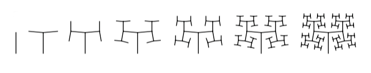
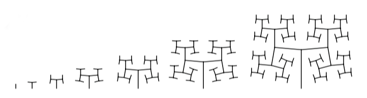

# ofxLSystemGrammar

[](https://ci.appveyor.com/project/edap/ofxlsystemgrammar)
[](https://travis-ci.org/edap/ofxLSystemGrammar)

It is currently tested on mac and OF >= 0.9.3.

This addon implements most of the grammars described in "The Algorithimic Beauty of Plants", a book written by Lyndenmayer and Prusinkiewicz, free available online at this [URL](http://algorithmicbotany.org/papers/#abop). This addon can be used to draw L-System plants or fractals. Although in the examples you can see some 2D graphic interpretation of this grammars, this addon takes care only of the strings generation.
If you need a turtle graphic interpretation of the grammars generated with ofxLSystemGrammar, in 3D, have a look at [ofxLSystem](https://www.github.com/edap/ofxLSystem) to see which kind of meshes it is possible to draw using this addon.

An [L-System](https://en.wikipedia.org/wiki/L-system) is composed by an axiom and rules. The axiom is the seed, the initial brick of the structure that we want to create, the rules are instructions about how this seed will reproduce itself. The simplest class of L-System, those which are deterministic and context-free, are called DOLsystems. Let's see an easy example:
- Assume that our string is composed by 2 "words", `A` and `B`.
- Each letter is associated with a rewriting rule:  `A` becomes `AB`, and `B` becomes `A`
- The rewriting process starts from a string called "axiom". In this example, let declare as axiom the "word" `B`
- The first five derivations of the described DOLsystem will be these string:


You can use this addon to produce them:

```cpp
vector<string> rules {"A -> AB", "B -> A"};
auto result = ofxLSystemGrammar::buildSentences(rules, 5, "B");
```

It will give as result a `vector<string>` containing:
```
vector<string> result{
    "B",
    "A",
    "AB",
    "ABA",
    "ABAAB",
    "ABAABABA",
};
```

## Supported platforms
*mac* and OF  0.9.3

*linux* g++ 4.9 and OF version 0.9.3. On linux, you need g++ >= 4.9 and the `-std=gnu++14` flag. Otherwise you will have an error about `std::regex_iterator`. This flag is the default on OF 0.9.3, just in case you set it to `std=c++11` as described in this [post]( https://forum.openframeworks.cc/t/openframeworks-0-9-qtcreator/21312/7).

## Interface
In this example you have seen the small interface of ofxLSystemGrammar. This addon has only one public method `buildSentences` that returns a `vector<string>`. This is the signature of this method:

```cpp
static const vector<string> buildSentences(vector<string> _rules, const unsigned int _n_steps, string _axiom, map<string,float> _constants = Constants());
```

- `_rules` are the reproduction rules, in the example `{"A -> AB", "B -> A"};`
- `_n_steps` is an integer that defines how many times the axiom will be rewritten, in the example `5`
- `_axiom` is the initial "seed", that will be rewritten, in the example `B`
- `_constant` Constants is a user defined type `typedef map<string,float> Constants;` and it is empty by default. There is some example later that shows how to use it.

## Turtle Graphics
Adding a [turtle graphic](https://en.wikipedia.org/wiki/Turtle_graphics) interpretation of these sentences, allow us to draw fractals and L-System plants.
A turtle graphic interpretation can take as input the result of this operation:

```cpp
vector<string> rules {"F -> F − F + F + FF − F − F + F"};
auto result = ofxLSystemGrammar::buildSentences(rules, 4, "F");
```

An draw something like this:


For the sake of clarity, there is a picture containing a turtle interpretation for each of the following examples.

## Bracketed Edge Rewriting

A bracketed L-System contains square brackets `[ ]` that are used by the turtle to mark a position, go forth and come back to the marked position. Bracketd L-System allows branching needed in producing weeds, bushes and trees.
Edge-rewriting means that productions rules substitute figures for polygon *edges*

```cpp
vector<string> rule {"F->F[+F]F[-F][F]"};
auto result = ofxLSystemGrammar::buildSentences(rule, 4, "F");
```



## Bracketed Node Rewriting

In node rewriting, productions operate on polygon *vertices*. That means that after each rewriting we can define vertices that will become branches.

```cpp
vector<string> rules {"X->F[+X][-X]FX", "F->FF"};
auto result = ofxLSystemGrammar::buildSentences(rules, 6, "X");
```



## Stochastic Grammar

A Stochastic L-System takes more than one rule, and apply each rule depending on a probability factor from `0.0` to `0.1`. If we define 2 rules, one with a probability factor of `80.00` and the other with probability `20.00`, most of the time only the first rule will be applied, and the second one will be ignored. Running 6 times the following instructions

```cpp
vector<string> rules {
  "0.33 -> F -> F[+F]F[−F]F",
  "0.33 -> F -> F[+F]F",
  "0.34 -> F -> F[−F]F",
};
auto result = ofxLSystemGrammar::buildSentences(rules, 6, "X");
```
Can generate figure like this:



In this example, all the rules have more or less the same possibility to be applied

*note*: The sum of all the probability factors has to be between 0.95 and 1.0.

## Parametric Grammar
A parametric grammar contains numeric parameters, the parameters can be evaluated and passed to the turtle. A typical parameter that a turtle could read is the length of a branch, or the degrees of the angle.
In the following example we pass parameters to the letter `A` and `B`, and we use parameters inside conditions, do decide if to apply the rule or not. For example, the first rule `A(x,y) -> A(x*2,x+y);` will be applied only if the value of `y` is less or equal to 3.

```cpp
vector<string> rules {
  "A(x,y): y<=3 -> A(x*2,x+y)",
  "A(x,y): y>3 -> B(x)A(x/y,0)",
  "B(x) :x<1 -> C",
  "B(x) : x>=1 -> B(x-1)"
};
auto result = ofxLSystemGrammar::buildSentences(rules, 3, "B(2),A(4,4)");
```

These production rules and this axiom will generate the following sequences:



*note* the actual implementation does not support nested operations like `(x+(y-2))`, but just single plain operation like `(x+2)`. The current supported operators are `+`, `-`, `*`, `/`.

## Parametric Grammar with constants

It is also possible to define constants, that will be used to calculate the value of the parameters. For example:

```cpp
// we initialize the constant "R" to the value 1.456
map<string, float> constants;
constants.insert(make_pair("R", 1.456));

vector<string> rule { "A(s) -> F (s)[+A(s/R)][−A(s/R)]"}
auto result = ofxLSystemGrammar::buildSentences(rule, 6, "A(1)", constants);
```

The turtle interpretation of this operation generates a space filling figure


If we change the operation, and instead to devide for `R` we multiply for `R`, we obtain a slightly different image

```cpp
// we initialize the constant "R" to the value 1.456
map<string, float> constants;
constants.insert(make_pair("R", 1.456));

vector<string> rule { "A(s) -> F (s)[+A(s*R)][−A(s*R)]"}
auto result = ofxLSystemGrammar::buildSentences(rule, 6, "A(1)", constants);
```



The first case, with the `/`, emphasizes the fractal character of the resulting structure. The second case, with the `*` suggests the growth of a tree.
